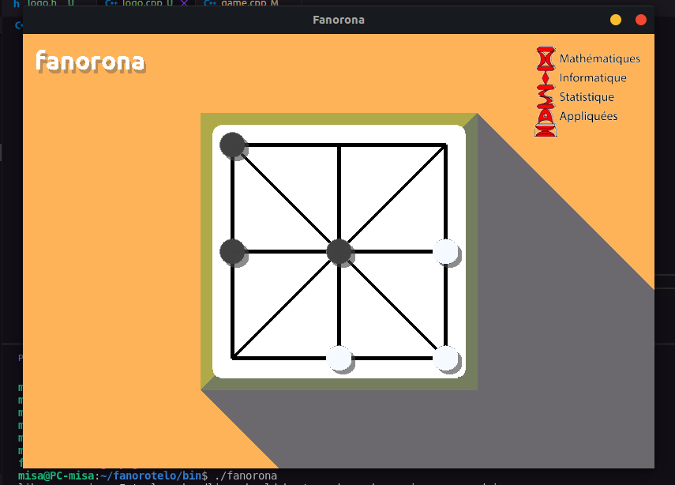

# fanorona
Strategy board game.
<a href="https://en.wikipedia.org/wiki/Fanorona">Learn the rules</a>

## Install Dependencies
```
sudo apt install libsdl1.2-dev libsdl-ttf2.0-dev libsdl-gfx1.2-dev
```

## Compilation
```
g++ -c *.cpp base/*.cpp
g++ *.o -lSDL -lSDL_ttf -lSDL_gfx -o fanorona
```

# Architecture
## Base API
- App
- Group
- GameObject
    - Text
        - Fps
    - __ button __
        - Button
            - Ok
            - Cancel
    - Confirm
- Timer
    - Chrono
## Game API
- App
    - Game
- GameObject 
    - Background
    - Piece
    - ShadowedText

___
## screenshot

